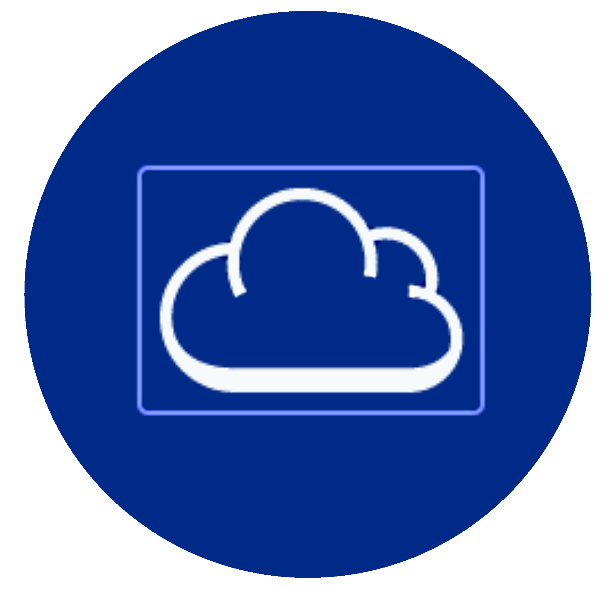

<h1 align="center">Heaven Client</h1>

<em><h5 align="center">(Powered by Helios Launcher by Daniel Scalzi)</h5></em>

Join modded servers without worrying about installing Java, Forge, or other mods. We'll handle that for you.

## Features

* 🔒 Full account management.
  * Add multiple accounts and easily switch between them.
  * Credentials are never stored and transmitted directly to Mojang.
* 📂 Efficient asset management.
  * Receive client updates as soon as we release them.
  * Files are validated before launch. Corrupt or incorrect files will be redownloaded.
* ☕ **Automatic Java validation.**
  * If you have an incompatible version of Java installed, we'll install the right one *for you*.
  * You do not need to have Java installed to run the launcher.
* 📰 News feed natively built into the launcher.
* ⚙️ Intuitive settings management, including a Java control panel.
* Supports all of our servers.
  * Switch between server configurations with ease.
  * View the player count of the selected server.
* Automatic updates. That's right, the launcher updates itself.
*  View the status of Mojang's services.
